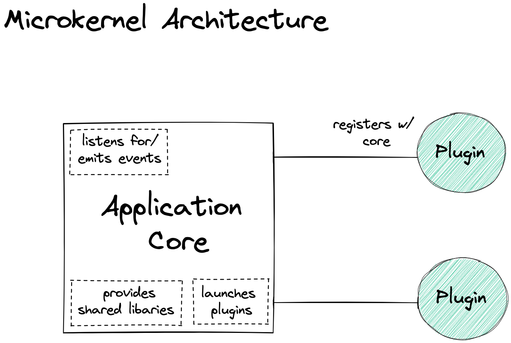

# bigbox

The next online everything store.

## Local Development

### Getting Started

- Do `npm start` to launch the application

### API

- Create an order

  - `curl -X POST -H "Content-Type: application/json" -d '{ "customerId": "-NVKP0GfTT3RjDk_p4NQ", "items":[{"name":"cookie","qty":1},{"name":"sandwich","qty":1},{"name":"salad","qty":1}] }' http://localhost:3000/orders`

- Pay for an existing order

  - `curl -X POST http://localhost:3000/orders/:orderId/payment`

- Get current inventory
  - `curl -X POST http://localhost:3000/items`

- Get all emitted system events
  - `curl http://localhost:3000/events`

  ### Architecture Notes

  This application is an example of an the Microkernel Architectural pattern.

  The application core is the heart of this pattern. It provides a simple interface for registering and starting plugins. A plugin will register with the application and on start, the application will launch all registered plugins.

  

   Note that the plugins cannot communicate with each other directly. They can only talk to the application core. This is a fundamental principle of the Microkernel architecture, where the application core acts as a mediator between plugins, providing a well-defined interface for communication.